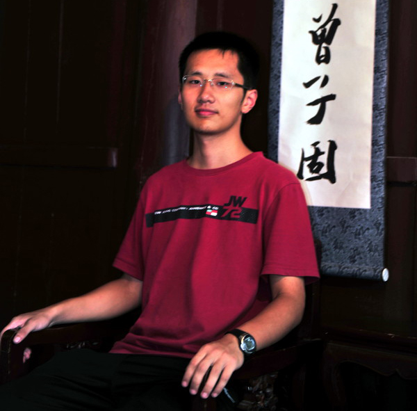

<table style="width: 900px" class="style1" align="center">
	<tr>
	<td width="200" align="left">
</td>	<td width="450"> <h2>Haoyang Zeng (曾浩洋) </h2>
		<a href="http://www.csail.mit.edu/">Computer Science & Artificial Intelligence Laboratory </a> 
		<a href="http://www.mit.edu/">Massachusetts Institute of Technology</a>  
		Office: 32 Vassar St G-540, MIT, Cambridge, MA, 02139 
		Email: my last name AT csail dot mit dot edu

		</td>
	</tr>
</table>

I am currently a fifth year Ph.D. student in [Electrical Engineering and Computer Science](https://www.eecs.mit.edu/) department at MIT. I am advised by Professor [David Gifford](http://www.psrg.lcs.mit.edu/~gifford/) in [Computational Genomics Research Group](http://cgs.csail.mit.edu/)

Before coming to MIT, I got my bachelor's degree at [Tsinghua University](http://www.tsinghua.edu.cn/publish/newthuen/index.html) in Beijing, China. I have worked with Professor [David Dill](https://profiles.stanford.edu/david-dill) in Stanford in the summer of 2012. I have also been to [University of Toronto](http://www.utoronto.ca/) as an exchange student.

My research interests lie on computational biology and bioinformatics in general. Specifically, I am interested in functional genomics where we unveil regulatory network and genomic element using machine learning and statistical approaches. I am currently working on modeling and predicting how short sequence regulate and influence epigenomic signal, transcription factor (TF) binding, and gene expression in cis.
