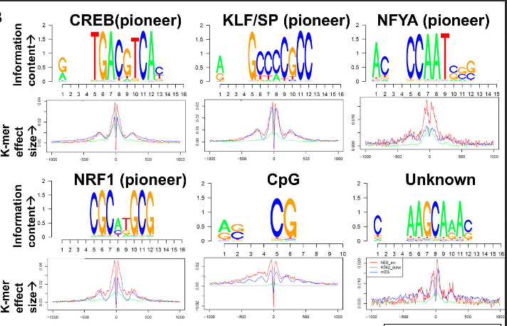
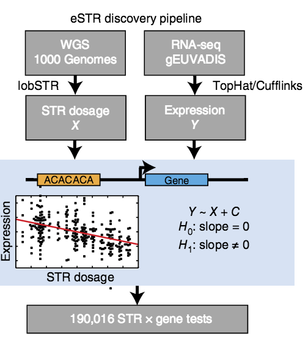
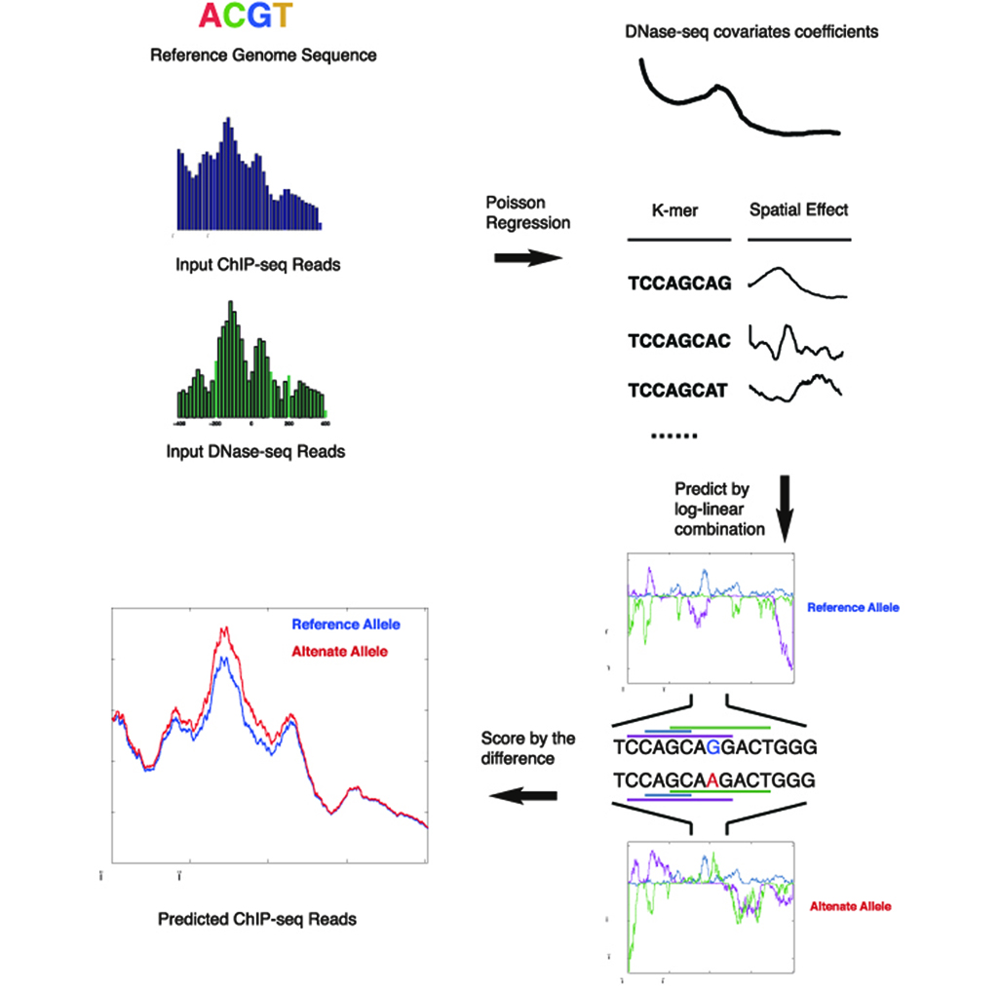
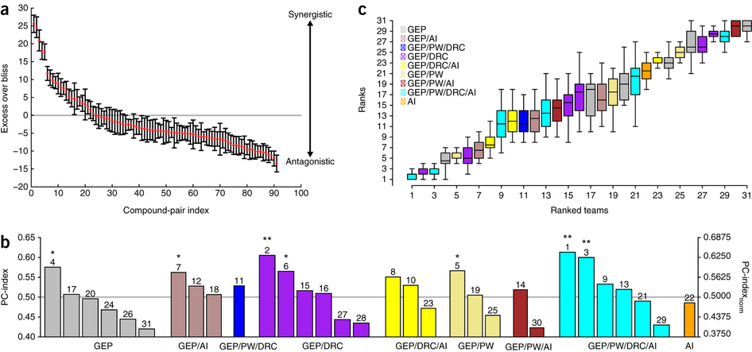
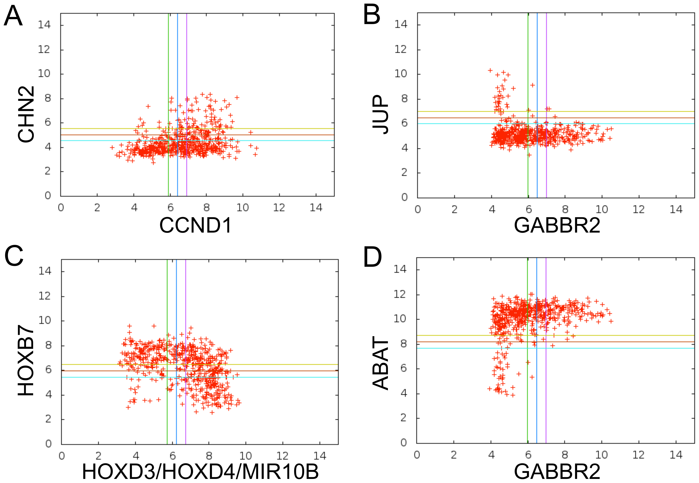

More info on my [Google Scholar](https://scholar.google.com/citations?user=5z2rh_oAAAAJ&hl=en) profile.

### Refereed Publications

#### 2016
<table style="width: 800px" class="style1" align="center">
	<tr>
	<td width="90" align="left">
</td>	<td width="600"> Hashimoto T, Sherwood RI, Kang DD, Barkal AA, <b>Zeng H</b>, Emons BJM, Srinivasan S, Rajagopal N, Jaakkola T, and Gifford DK.
 <b>A DNA code governs chromatin accessibility.</b>
 

	<i>Genome Research</i>, doi:
10.1101/gr.199778.115</i> <a href='http://genome.cshlp.org/content/early/2016/07/25/gr.199778.115.abstract'>[Journal]</a>

	</td>
	</tr>
</table>

<table style="width: 800px" class="style1" align="center">
	<tr>
	<td width="90" align="left">
</td>	<td width="600"> <b>Zeng H</b>,  Edwards M, Liu G, and Gifford DK. 
 <b>Convolutional Neural Network Architectures for Predicting DNA-Protein Binding.</b>
 
	<i>Intelligent Systems for Molecular Biology</i> (ISMB), 2016
	 
	<i>Bioinformatics</i>, 32(12):i121-i127.<a href='http://bioinformatics.oxfordjournals.org/content/32/12/i121.short'>[Journal]</a>

	</td>
	</tr>
</table>

#### 2015
<table style="width: 800px" class="style1" align="center">
	<tr>
	<td width="90" align="left">
</td>	<td width="600"> Gymrek M, Willems T, Guilmatre A, <b>Zeng H</b>,  Markus B,  Georgiev S, Daly MJ, Price AL, Pritchard J,  Sharp A and Erlich Y. 
 <b>Abundant contribution of short tandem repeats to gene expression variation in humans</b>
 
	<i>Nature Genetics</i>, 48(1), 22–29.  <a href='http://www.nature.com/ng/journal/vaop/ncurrent/full/ng.3461.html'>[Journal]</a>

	</td>
	</tr>
</table>

<table style="width: 800px" class="style1" align="center">
	<tr>
	<td width="90" align="left">
</td>	<td width="600"> <b>Zeng H</b>, Hashimoto TB, Kang DD, and Gifford DK.   
 <b>GERV: A statistical method for generative evaluation of regulatory variants for transcription factor binding</b>
 
	<i>Bioinformatics</i>, 32(4), 490-496. <a href='http://bioinformatics.oxfordjournals.org/content/early/2015/11/05/bioinformatics.btv565'>[Journal]</a>

	</td>
	</tr>
</table>

#### 2014

<table style="width: 800px" class="style1" align="center">
	<tr>
	<td width="90" align="left">
</td>	<td width="600"> Bansal M, Yang J, Karan C, Menden MP, Costello JC, Tang H et al. 
 <b>A community computational challenge to predict the activity of pairs of compounds</b>
 
	<i>Nature Biotechnology</i>, 32(12), 1213-1222. <a href='http://www.nature.com/nbt/journal/v32/n12/full/nbt.3052.html'>[Journal]</a>

	</td>
	</tr>
</table>
	

<table style="width: 800px" class="style1" align="center">
	<tr>
	<td width="90" align="left">
</td>	<td width="600"> Sinha S, Tsang EK, <b>Zeng H</b>, Meister M, and Dill DL.    
 <b>Mining TCGA data using Boolean implications</b>
 
	<i>PLOS ONE</i>. doi: 10.1093/bioinformatics/btv565. <a href='http://www.plosone.org/article/info%3Adoi%2F10.1371%2Fjournal.pone.0102119'>[Journal]</a>

	</td>
	</tr>
</table>

#### 2012
* **Zeng H**, Meister M, Sinha S, and Dill DL.   
	<b>Integrative analysis of cancer data using Boolean implication networks</b>.  
	_RECOMB SB/RG/DREAM, 2012_. [[poster]](http://www.mit.edu/~haoyangz/files/ugvrPoster.pdf)

### Others
+ Best performance in [eQTL-causal SNPs challenge](https://genomeinterpretation.org/content/4-eQTL-causal_SNPs) in the fourth Critical Assessment of Genome Interpretation (CAGI4) prediction competition. (2016)
